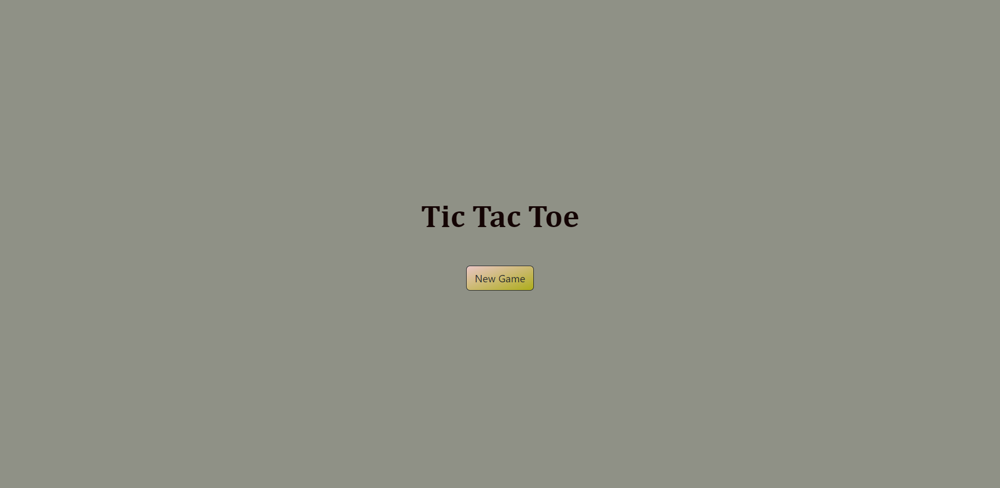
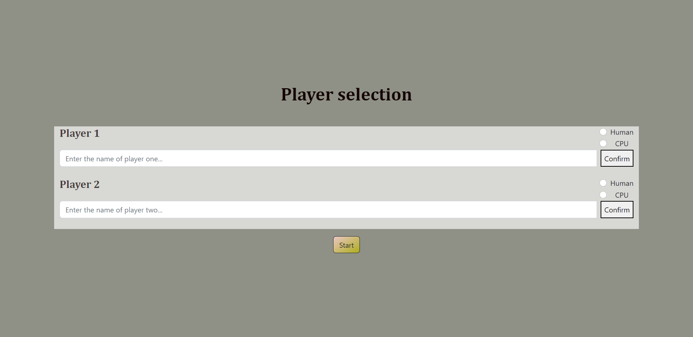
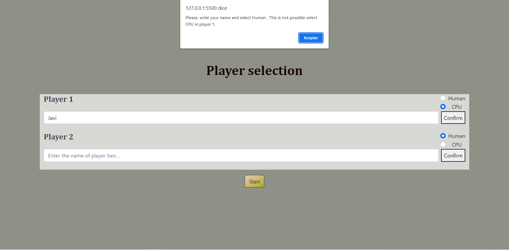
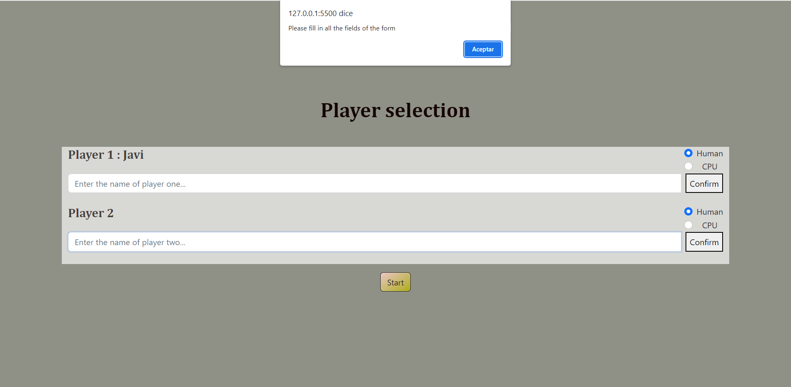
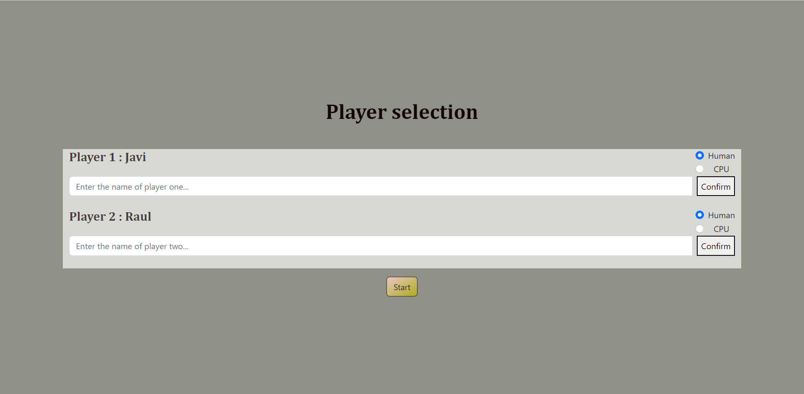
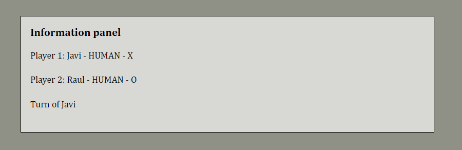
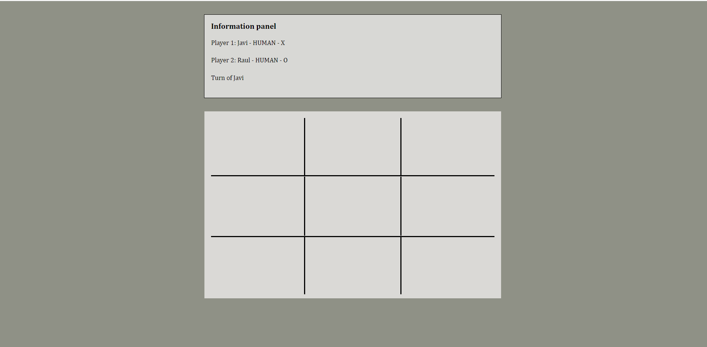
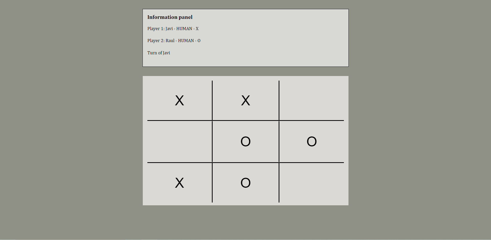
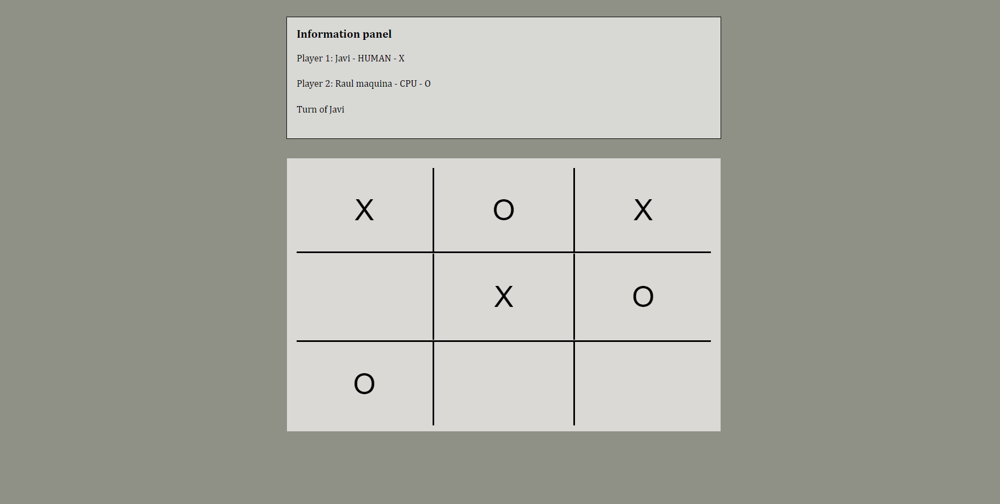
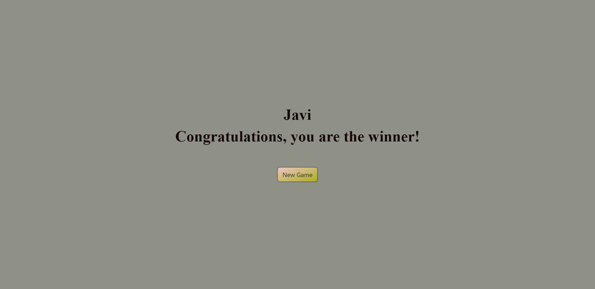

## Tic tac toe
Hola!
👋 Soy Javier Moya. 
💻 Soy un FullStack Developer en  <kbd>⇥</kbd>    

### Sobre el proyecto

Este proyecto consiste en diseñar el famoso juego "Tic tac toe", jugando solamente con 3 fichas e intercambiándolas en el momento en el que ya estan todas jugadas en el tablero hasta conseguir la victoria.

Para empezar, podemos ver la página principal:
 

Al darle click al botón "New Game", nos lleva a la página de selección de jugadores:

 
  
En player selection, rellenaremos todos los campos para poder acceder al juego:
   

Para Player 1, únicamente podremos seleccionar la opción "Human". Si seleccionamos "CPU" nos saldrá un alert indicándonos lo anteriormente explicado.

  

Debemos rellenar los campos y darle a Confirm en los dos casos; sino saltará un alert indicándonos que completemos el formulario al completo.

  

Si todos los campos estan correctamente rellenados y confirmados, pulsaremos al Start y nos llevará al terreno de juego.
Observamos que están correctamente rellenados, ya que así nos lo indica "Player 1" y "Player 2".

  

En la interfaz del juego, en primer lugar observamos un panel con toda la información de los jugadores:
Por orden: Jugador nº - Nombre - Tipo - X/O
En la última linea observamos el turno de quién debe mover ficha.

  

Vemos el tablero debajo del panel de información, sobre el cual haremos click en cada casilla y pintará X o O en función del jugador.

Una vez comencemos a jugar, iremos poniendo fichas en cada turno. Si llegamos a poner todas y no ha habido un ganador, haremos click en una ficha, la quitaremos, y seguidamente pondremos esa misma ficha en la casilla vacía deseada.

 

En el caso de jugar contrá la CPU, es algo distinto. 
La CPU jugará aleatoriamente, y una vez estén puestas de la misma manera, quitará y pondrá en un hueco también aleatorio.
Las jugadas de la CPU irán acto seguido, después de que el Player 1("human") realice su movimiento, automáticamente.

 
 
Si se realiza una combinación ganadora, accederemos automáticamente a la pantalla del ganador.

 
En ella, contamos con el nombre del ganador, seguido de las enhorabuena. 
Por último, si pulsamos el botón "New game", accederemos a la pantalla de selección de jugadores, para formar una nueva partida.
 

### Elaborado con:

Para este proyecto, estas son las tecnologías que han sido utilizadas:
 

 

Puedes ver este proyecto en <kbd>⇥</kbd> [GitHub pages](hhttps://github.com/JavierMoyaSimo/project03-tictactoe/ "GitHub pages")

### Créditos

Autor: JavierMoyaSimo

Última vez editado: 14/10/2022
